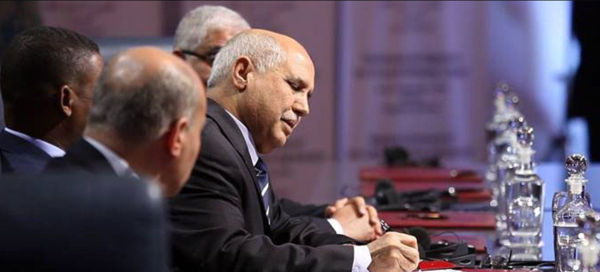
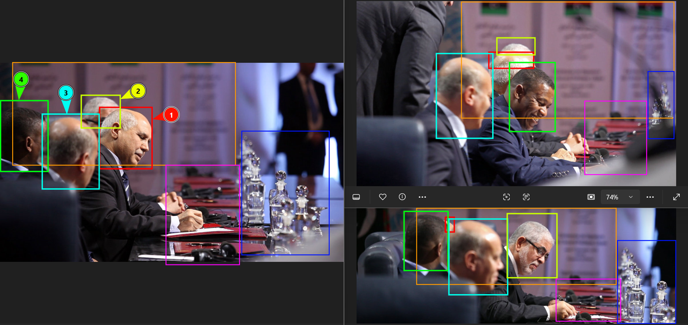
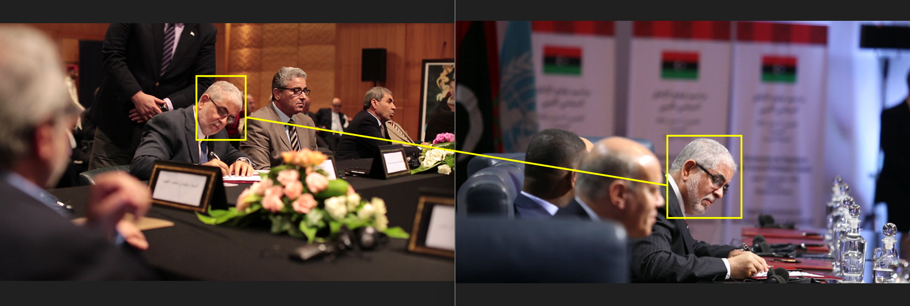
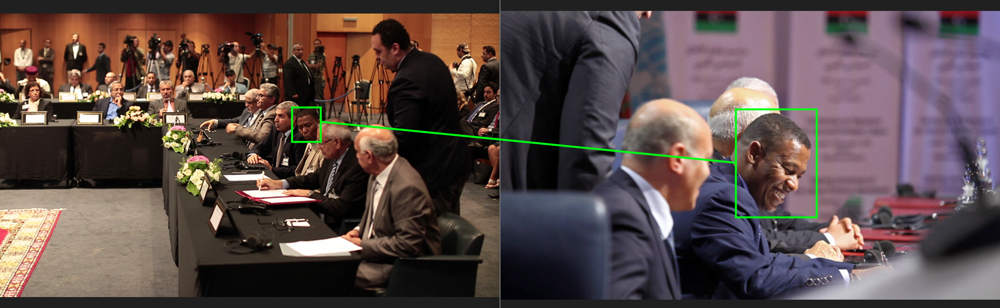
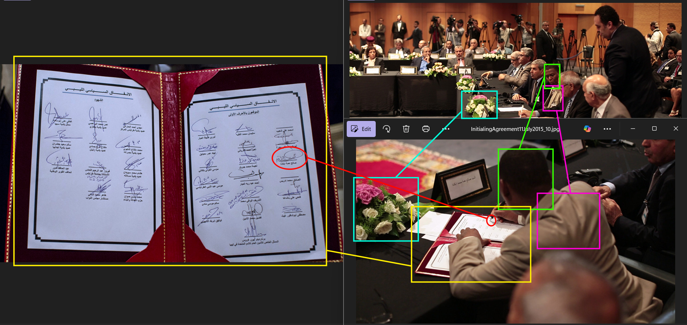
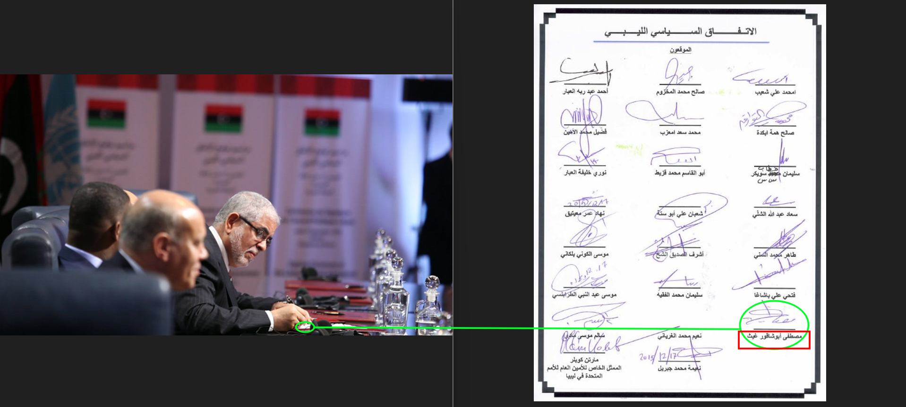
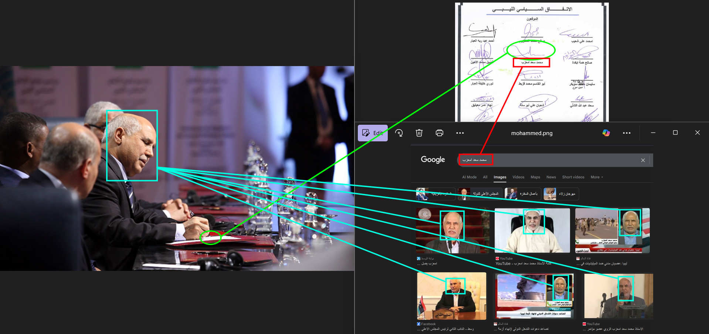
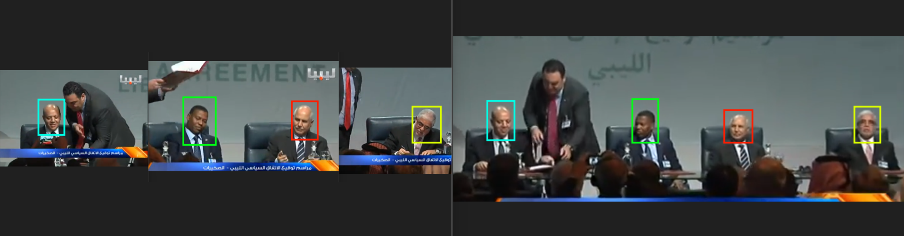
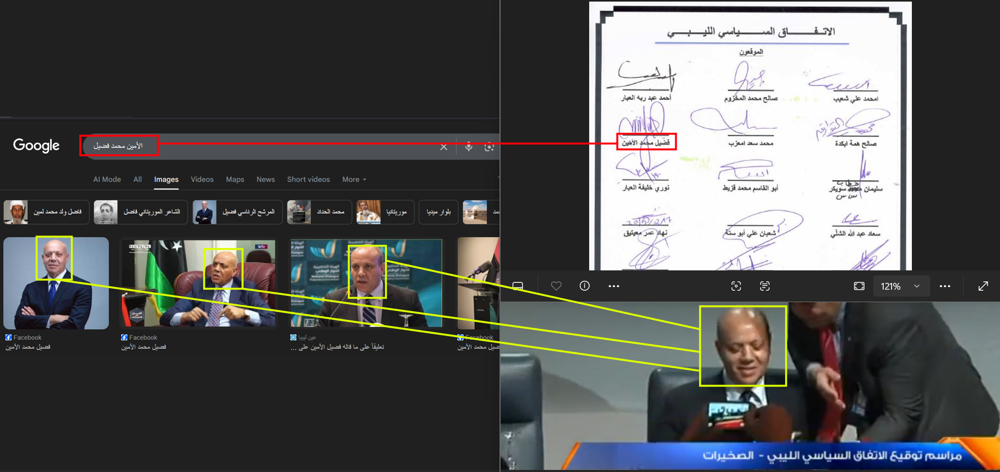

# Welcome to OSINT Exercise #011!

## Task briefing

    The photo below depicts four individuals.
    Your task is to identify them all.

## Analysis Process

I ran the given image through Google Lens and found [this](https://news.un.org/en/story/2015/12/518952) article on the United Nations website with identical match. This seems to be taken when Libyan political leaders were signing the Libyan Political Agreement in Skhirat, Morocco, on December 17, 2015, to form in interim government in Libya with "a Presidency Council, Cabinet, House of Representatives and State Council." However, there were no names of participants from which I could search for the people in the image. I then copied the caption under the image which says `"UNSMIL | Signing of the Libyan Political Agreement in Skhirat, Morocco, 17 December 2015"` and searched on Google, to which I found this top result entry titled "Libyan parties sign the Libyan Political Agreement in Skhirat, Morocco, 17 December 2015" from the UNSMIL (United Nations Support Mission in Libya) [website](https://unsmil.unmissions.org/en), which might contain more images of the event that captured the faces of the other three men that were obscured in the original image. The link, however, redirected me to a 404 page, meaning the article no longer existed. I went to http://web.archive.org/ to check if the link has been archived, and it was, with the earliest snapshot being taken on October 21, 2021, which you can view [here](https://web.archive.org/web/20211027030058/https://unsmil.unmissions.org/photos-libyan-parties-sign-libyan-political-agreement-skhirat-morocco-17-december-2015). As expected, the archived page provided a lot more photos of the event, and two of them essentially are photos taken from the same position and angle but probably seconds are part because more faces are revealed which you can see from the side by side comparison to the original image below:

With this, I started doing reverse image search on new photos from the archived link, and this time found another article describing an earlier draft of the Libya Political Agreement (UN draft agreement) with photos of some delegates signing it on July 11, 2015, which you could find [here](https://libyaherald.com/2015/07/skhirat-draft-initialled-gnc-left-aside/). Of the photos I found in this article, 2 images each captured 2 different faces very similar to the former ones from the other UNSMIL website (archived), whom I suspect to be from the 4 people in the original image, as shown below:

In the former comparison (man in glasses from two different events), the caption under the image on the right mentioned this person as "former Deputy Prime Minister Mustafa Abushagur," which, at this point, I'm almost sure was one of the man who needed to be identified in the original image. Although, only some time later did I find more convincing piece of evidence to verify that this is the same person with glasses in the photo given in the task briefing. At that moment, however, I just moved on to find the name of the man in the latter comparison (highlighted in green boundig boxes).

I did more reverse image search (this time using Yandex, with photos most oftenly coming from [Mungfali](https://mungfali.com/explore.php?q=libyan+political+agreement) and [Mavink](https://mavink.com/explore.php?q=Photos%3A+Libyan+parties+sign+the+Libyan+Political+Agreement+in+Skhirat+)) with photos of the second man (as labeled in the original 3 photos comparison) and found two [here](https://www.alamy.com/saleh-hemma-member-of-the-representative-committee-of-tobruk-left-speaks-to-the-media-as-mohammed-chouaib-head-of-delegation-from-the-un-recognized-government-in-the-eastern-city-of-tobruk-right-and-abdil-majid-saif-ennasr-general-consul-of-libya-to-morocco-2nd-right-look-on-outside-the-palais-des-congres-of-skhirate-30-km-south-of-rabat-wednesday-march-25-2015-ap-photoabdeljalil-bounhar-image517984648.html) and [here](https://www.alamy.com/saleh-hemma-member-of-the-representative-committee-of-tobruk-2nd-left-mohammed-chouaib-head-of-delegation-from-the-un-recognized-government-in-the-eastern-city-of-tobruk-3rd-left-and-abdil-majid-saif-ennasr-general-consul-of-libya-to-morocco-2nd-right-leave-the-palais-des-congres-of-skhirate-30-km-south-of-rabat-wednesday-march-25-2015-ap-photoabdeljalil-bounhar-image517984647.html) on Alamy website taken of a guy named Saleh Hemma who was a member of the Representative Committee of Tobruk outside Palais des Congres of Skhirate on March 25, 2015. Although this is a different date, both photos on Alamy were taken on the same day and in Skhirate, Morocco, the same town where the UN-facilitated Libyan Political Dialogues held on July 11 and December 17 in the same year took place. Combined with the fact that the man in these two photos is a member of the Representative Committee of Tobruk, in other words, the Libyan House of Representatives which was relocated to the eastern city of Tobruk in August 2014 and part of the Libyan political bodies that signed the agreement on December 17, I also became convinced that this was the second man in the original image and his name was Saleh Hemma. That being said, I also wanted to check other sources that would confirm this fact, other than just the visual similarities of the faces.

After doing more reverse image search I realized that the two remaining men were not in any photo (that I could find) from these events, especially the guy labeled 3 in neon blue bounding boxes whose face was completely obscured from all photos he appeared in that I could find, I went back to one of the former articles [here](https://libyaherald.com/2015/07/skhirat-draft-initialled-gnc-left-aside/) to instead do a reverse image search one of its photo capturing the content of the inital UN draft agreement which contains signatures of the delegates who attended the dialogues on July 11, to hopefully get a similar looking picture of the draft signed on December 17 instead. From this search, I found another archived [article](https://web.archive.org/web/20201022191922/https://unsmil.unmissions.org/libyan-dialogue-participants-initial-libyan-political-agreeement-skhirat-morocco-11072015) from UNSMIL containing more photos of the dialogue held on July 11, including a photo of the initial draft with higher resolution than the previous article as well as one taken from behind who appeared to be Saleh Hemma (based on the light brown two-piece suit I recognized him from another article which included a photo of him taken from the front at the same event) where you can see him signing a slot in the third row and third column of the initial draft:

It suddenly struck me that if I could find the Libyan Political Agreement signed on December 17 and compare their signatures, I could verify that this man was one of the four in the UN meeting photo provided in the task briefing. This time, while using Bing reverse image search (as they have built in text extraction and translation features in case I want the documen translated immediately) I found a scan of [this](https://th.bing.com/th/id/R.2e2778283b77531a5b5bbcc2f54e82c7?rik=OTVmYp7eD5lE%2bQ&pid=ImgRaw&r=0) document from the visual matches overview of the search results, which issaid to come from [this](https://www.temehu.com/un-resolutions-1970-1973.htm) website, however, when I checked the page no such image was there. The document however, translated from Arabic to English, was titled "Libyan Political Agreement" followed by 21 signatures (out of 23 slots) below it, with one signature at the very bottom of the document has the date 12/17/2015 written alongside it. This was further corroborated by another [article](https://lawsociety.ly/convention/%D8%A7%D9%84%D8%A7%D8%AA%D9%81%D8%A7%D9%82-%D8%A7%D9%84%D8%B3%D9%8A%D8%A7%D8%B3%D9%8A-%D8%A7%D9%84%D9%84%D9%8A%D8%A8%D9%8A-%D8%A7%D9%84%D9%85%D9%88%D9%82%D8%B9-%D8%A8%D8%AA%D8%A7%D8%B1%D9%8A%D8%AE-17/) published on the same date (written in arabic) which listed the terms and conditions specified in the Libyan Political Agreement along with the 23 names of signatories at the end of the article that matched exactly the 23 names that appeared in the signed document (although 2 didn't sign). At this point I was sure that the scanned document was legitimate, and upon comparing the signatures I found one looking very similar to Saleh Hemma's in both documents:

By searching the arabic name under the highlighted signature in the 12/17 document (`ابكدة همة صالح`), I found Saleh Hemma' facebook page in the top search results, with his name spelled a bit differently as `Salih Hama Bakdah`, but his appearance was identical to the black man in all other photos I presented from the UN Libyan dialogues in July and December. That confirmed the identity of the person labeled as 2 in the original image given in the task briefing. The second easiest person to confirm is the man with glasses, as in one of the photos presented above (also highlighted below) with him in the picture the photographer also captured the position where he sign his signature which was somewhere at the bottom of the document, in this case it turned out to be on the second last row of the third column:

The name below the signature highlighted in the green circle, `غيث أبوشافور مصطفى`, when searched on Google, showed the first result as a [wikipedia page](https://en.wikipedia.org/wiki/Mustafa_A._G._Abushagur) of `Mustafa A. G. Abushagur`, a Libyan politician and former deputy prime minister of Libya from November 22, 2011, to November 14, 2012, whose appearance matched exactly the man with glasses in the photos presented above.

The third person whose identity I found (labeled as 1 in the original photo) was the man whose side face was visible in the photo provided in the challenge, judging by the place where he signed the document, I assumed it had to be in the middle column in the second or third row, and when searching on Google the name printed under the signature in the second row and column (`محمد سعد امعزب`), the images tab showed a man whose facial features were identical to the man in the original photo (for example [this](https://alwasat.ly/news/libya/124780) one), and when I looked up his English name, `Mohammed Imazzeb`, one of the results was an [article](https://libyaobserver.ly/economy/congressman-imazzeb-fuel-subsidies-cut-be-effect-within-days) from _The Libya Observer_ which indicated that, as of May 2015, he was the Head of the Finance and Planning Committee in the General National Congress (on of the Libyan political bodies whose representatives participated in the UN Libyan dialogue meeting on December 17, 2015 when the Libyan Political Agreement was signed), and according to [this](<https://en.wikipedia.org/wiki/High_Council_of_State_(Libya)>) wikipedia page he also served as the second deputy chairman of the Libyan High Council of State and was replaced by Fawzi Aqab in April 2018.

The last person whose identity was still unknown was the man in label 3 (highlighted in neon blue bounding boxes). Not only there were no photos taken of him signing the document nor was there any that showed a clear front or side view of his face, which made identifying this person pretty tricky. At this point I gave up on scrolling through the pictures and just tried to look for video recordings of this event, which showed no relevant results with English search query `Libyan Political Agreement December 17, 2015`, because the only youtube video found did not capture the moment the signing process was taking place of the people needed to be identified in the original photo, so I intead copied the Arabic title of the scanned December document (shown above), `الليبي السياسي الاتفاق`, which helped me find two very helpful videos that confirmed everything I have deducted so far, as well as the name of the last person I needed to identify. From [this](https://www.youtube.com/watch?v=NDbgiANiYOE) youtube video I took screenshots between the mark 1:03:31 to 1:04:21 when the signage process was taking place, and the camera zoomed in the person currently signing the document then switch angle to the next and lastly the man on the left most side before zooming out to all four men who just signed the document before the stood up and exchange handshakes and hugs with each other. The only different between the two images (one on the left was combined by three zoomed in camera view of each individual signage) was the text presented on the slide show in the background which transitioned from English to Arabic as soon as the last man on the left finished signing the agreement document which in the video you could observe between the mark 1:04:08 - 1:04:18.

Now that I could see the face of the the last man, I opened up the Libyan Political Agreement document again to find his name, and on the second row, first column was his name, `الأمين محمد فضيل`, whose English name was translated to `Fadel Mohamed Lamen`, who, according to [this](https://grokipedia.com/page/fadel_mohamed_lamen) article, was a Libyan political analyst and journalist who participated the Libyan Political Dialogue as an "independent coordinator" and one of the signatories of the 2015 Libyan Political Agreement. Below is a comparison of the visual similaries between the Google search result of the name and the man from the video footage:

To sum it up, according to the labels in the original photo, the 4 men in the image were:

    1.  Mohammed Imazzeb (محمد سعد امعزب), former Head of the Finance and Planning Committee in the General National Congress
    2.  Mustafa Abushagur (غيث أبوشافور مصطفى), former Deputy Prime Minister
    3.  Fadel Mohamed Lamen(الأمين محمد فضيل), Libyan political analyst and journalist
    4.  Saleh Hemma Bakdah (ابكدة همة صالح), member of the Representative Committee of Tobruk
