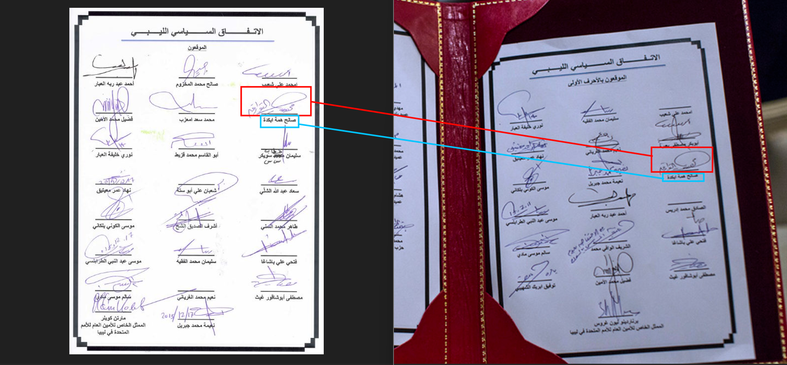

# Welcome to OSINT Exercise #011!

## Task briefing

    The photo below depicts four individuals.
    Your task is to identify them all.

## Methodology

Given the only clue was the image, I started my search by running it through Google Lens and found [this](https://news.un.org/en/story/2015/12/518952) article on the United Nations website with an identical visual match. According to the article, the photo depicted Libyan political leaders signing the Libyan Political Agreement in Skhirat, Morocco, on December 17, 2015, resulting in the formation of an interim government in Libya. Unfortunately, it didn't provide the names of participants that I could search for to find the people in the image. I then copied the caption beneath the image which read, `"UNSMIL | Signing of the Libyan Political Agreement in Skhirat, Morocco, 17 December 2015"` and searched it on Google. This returned a web link among the top results, titled "Libyan parties sign the Libyan Political Agreement in Skhirat, Morocco, 17 December 2015" from the UNSMIL (United Nations Support Mission in Libya) [website](https://unsmil.unmissions.org/en), which might contain more images of the event that captured the faces of the other three men that were obscured in the original image. The link, however, redirected me to a 404 page, meaning the article no longer existed. I went to http://web.archive.org/ to check if the link had been archived, and it had. The earliest snapshot was taken on October 21, 2021, which you can view [here](https://web.archive.org/web/20211027030058/https://unsmil.unmissions.org/photos-libyan-parties-sign-libyan-political-agreement-skhirat-morocco-17-december-2015). As expected, the archived page contained many additional photos from the event. Two of them appear to have been taken from nearly the same position and angle as the original image, likely only seconds apart, but with more faces visible. This can be seen in the side-by-side comparison with the original image below.

Using these new photos, I conducted reverse image searches and this time discovered another article discussing an earlier United Nations draft of the Libyan Political Agreement (LPA). The article includes photos of delegates signing the agreement on July 11, 2015, which can be found [here](https://libyaherald.com/2015/07/skhirat-draft-initialled-gnc-left-aside/). Among the photos in this article, two captured the faces that closely resemble the men whose faces had been obscured in the original photo, as illustrated below:

In the first comparison (the man wearing glasses from two different events), the caption beneath the image on the right identified him as former Deputy Prime Minister Mustafa Abushagur. At this stage, I was almost certain that he was one of the individuals who needed to be identified in the original image. However, it was only later that I found more convincing evidence to definitively confirm that he was the same man wearing glasses in the photo provided in the task briefing. At the time, I moved on to identifying the individual in the second comparison (highlighted in green bounding boxes).

I did more reverse image search (this time using Yandex, with photos most oftenly coming from [Mungfali](https://mungfali.com/explore.php?q=libyan+political+agreement) and [Mavink](https://mavink.com/explore.php?q=Photos%3A+Libyan+parties+sign+the+Libyan+Political+Agreement+in+Skhirat+)) using new photos capturing the face of the second man (as labeled in the original 3 photos comparison) and found two [here](https://www.alamy.com/saleh-hemma-member-of-the-representative-committee-of-tobruk-left-speaks-to-the-media-as-mohammed-chouaib-head-of-delegation-from-the-un-recognized-government-in-the-eastern-city-of-tobruk-right-and-abdil-majid-saif-ennasr-general-consul-of-libya-to-morocco-2nd-right-look-on-outside-the-palais-des-congres-of-skhirate-30-km-south-of-rabat-wednesday-march-25-2015-ap-photoabdeljalil-bounhar-image517984648.html) and [here](https://www.alamy.com/saleh-hemma-member-of-the-representative-committee-of-tobruk-2nd-left-mohammed-chouaib-head-of-delegation-from-the-un-recognized-government-in-the-eastern-city-of-tobruk-3rd-left-and-abdil-majid-saif-ennasr-general-consul-of-libya-to-morocco-2nd-right-leave-the-palais-des-congres-of-skhirate-30-km-south-of-rabat-wednesday-march-25-2015-ap-photoabdeljalil-bounhar-image517984647.html), showing a man named Saleh Hemma who was a member of the Representative Committee of Tobruk outside Palais des Congres of Skhirate on March 25, 2015 (according to the photo description). Although this is a different date, both photos were taken on the same day and in Skhirate, Morocco, the same town where the UN-facilitated Libyan Political Dialogues were held on July 11 and December 17 in the same year. The fact that the man in these two photos was a member of the Representative Committee of Tobruk, in other words, the Libyan House of Representatives which was relocated to the eastern city of Tobruk in August 2014 and part of the Libyan political bodies that signed the agreement on December 17, I became convinced that this was the second man in the original image and his name was Saleh Hemma. That said, I also wanted to consult additional sources to confirm this identification, rather than relying solely on the visual similarity of the faces.
After performing further reverse image searches, I realized that the two remaining men were not clearly visible in any of the photos I could find from these events. This was especially true for the third individual (highlighted in neon blue bounding boxes), whose face was completely obscured in every image in which he appeared. As a result, I returned to one of the earlier articles [here](https://libyaherald.com/2015/07/skhirat-draft-initialled-gnc-left-aside/) and did another reverse image search on the photo of the inital UN draft agreement, which contains signatures of the delegates who attended the dialogues on July 11, to hopefully get a similar looking picture of the draft signed on December 17 instead. From this search, I found another archived [article](https://web.archive.org/web/20201022191922/https://unsmil.unmissions.org/libyan-dialogue-participants-initial-libyan-political-agreeement-skhirat-morocco-11072015) from UNSMIL containing more photos of the dialogue held on July 11. These included a higher-resolution image of the initial draft of the agreement than the one previously found, as well as a photograph taken from behind of an individual who appeared to be Saleh Hemma. This identification was based on his light brown two-piece suit, which I recognized from another article that included a front-facing photo of him taken at the same event. In the image, he can be seen signing above the line in the third row and third column of the initial draft.

It then struck me that if I could find the Libyan Political Agreement signed on December 17 and compare their signatures, I could verify that this man was one of the four in the UN meeting photo provided in the task briefing. This time, using Bing reverse image search (as they have better text extraction and translation features than Google), I found a scan of [this](https://th.bing.com/th/id/R.2e2778283b77531a5b5bbcc2f54e82c7?rik=OTVmYp7eD5lE%2bQ&pid=ImgRaw&r=0) document from the visual matches overview of the search results, which was linked to [this](https://www.temehu.com/un-resolutions-1970-1973.htm) website, yet I checked all the links and attachments on the page and found no such image. The title of the document, written in Arabic, translates to “Libyan Political Agreement.” Beneath it are 21 signatures (out of a total of 23 signatories), with the final signature accompanied by a handwritten date of 12/17/2015. This was further corroborated by another [article](https://lawsociety.ly/convention/%D8%A7%D9%84%D8%A7%D8%AA%D9%81%D8%A7%D9%82-%D8%A7%D9%84%D8%B3%D9%8A%D8%A7%D8%B3%D9%8A-%D8%A7%D9%84%D9%84%D9%8A%D8%A8%D9%8A-%D8%A7%D9%84%D9%85%D9%88%D9%82%D8%B9-%D8%A8%D8%AA%D8%A7%D8%B1%D9%8A%D8%AE-17/) published on the same date and also written in Arabic, which outlined the terms and conditions of the Libyan Political Agreement (LPA). The article listed the names of all 23 signatories at the end, which matched exactly the 23 names shown on the signed document, although two of them did not ultimately sign. At this juncture, I was confident that the scanned document was legitimate, and upon comparing the signatures I found one looking very similar to Saleh Hemma's in both documents:

By searching the Arabic name beneath the signature line in the signed agreement, which read `ابكدة همة صالح`, I found Saleh Hemma' Facebook page in the top search results. On this page, his name was spelled as `Salih Hama Bakdah`, which is slightly differnet from `Saleh Hemma`, but his appearance was identical to the black man in all the previous photos in which he appeared.

The second easiest person to confirm is the man with glasses, as one of the previous photos presented above (and also highlighted below) also captured the position where he sign the agreement which seemed to be at the bottom of the document. I searched up some names in the few bottom rows of signatures and found that his on the second last row of the third column:

The name below the signature line (as highlighted in the green circle) read `غيث أبوشافور مصطفى`, and a Google search of this name returned a [wikipedia page](https://en.wikipedia.org/wiki/Mustafa_A._G._Abushagur) of `Mustafa A. G. Abushagur`, a Libyan politician and former deputy prime minister of Libya from November 22, 2011, to November 14, 2012, whose appearance matched exactly that of the man wearing glasses in the previous photos.

The third person I identified was the man labeled as 1 in the original photo and was the only one whose side face was fully visible. Following the same method I used earlier to identify Mustafa Abushagur, I took note of where he signed his name in the agreement, which looked like it was in the middle column in the second or third row. Again, I searched a few names around that area and found that the correct one lies on the second row and column: `محمد سعد امعزب`. On Google images tab, the results featured the same man whose countenance resembled the first the man in the original photo (for example [this](https://alwasat.ly/news/libya/124780) one). I also looked up his English name, which translates to `Mohammed Imazzeb`, and found that one of the results was an [article](https://libyaobserver.ly/economy/congressman-imazzeb-fuel-subsidies-cut-be-effect-within-days) from _The Libya Observer_, indicating that as of May 2015, he was the Head of the Finance and Planning Committee in the General National Congress (one of the Libyan political bodies that participated in the UN Libyan Dialogue Meeting on December 17, 2015, during which the Libyan Political Agreement was signed). There was also another [source](<https://en.wikipedia.org/wiki/High_Council_of_State_(Libya)>) pointing to him being the second deputy chairman of the Libyan High Council of State around the same time the LPA ws signed, although he was later replaced by Fawzi Aqab in April 2018.

The only person whose identity was still unknown at this point was the man labeled as 3 (highlighted in neon blue bounding boxes). Not only there were no photos taken of him signing the document nor was there any that showed a clear front or side view of his face, which made identifying this person pretty tricky. On that account, I gave up on scrolling through the pictures and started searching for any video recordings of this event, but found no satisfactory results in English because the only one that showed up was a minute long video footage of the LPA signing event on December 17, 2015, did not even capture the signing process that included the man in question, so I searched Google the for agreement in Arabic (`الليبي السياسي الاتفاق`). This led me to a two-hour-long YouTube video that confirmed the identities of every individual I had identified so far, as well as the name of the final person I needed to identify. From [this](https://www.youtube.com/watch?v=NDbgiANiYOE) video, I took screenshots between 1:03:31 and 1:04:21, when the signing process was taking place. During this segment, the camera zoomed in on the person currently signing the document, then switched angles to the next signer, and finally focused on the man on the leftmost side. It then zoomed out to show all four men who had just signed the document before they stood up and exchanged handshakes and hugs. The only difference between the two images (the left one was created by combining three zoomed in camera views of each individual signage) was the text presented on the slide show in the background which transitioned from English to Arabic as soon as the last man on the left finished signing the agreement. You could observe the moment the text changed between the mark 1:04:08 - 1:04:18 in the video.

Now that the face of the last man has been revealed, I opened up the LPA signature lists again to find his name, and on the second row and first column was his name, `الأمين محمد فضيل`, which translates to `Fadel Mohamed Lamen`, who, according to [this](https://grokipedia.com/page/fadel_mohamed_lamen) article, was a Libyan political analyst and journalist who participated the Libyan Political Dialogue as an "independent coordinator" and one of the signatories of the 2015 LPA. Below is a comparison of the visual similaries between the Google search result of the name and the man from the video footage:

In summary, according to the labels in the original photo, the 4 men in the image were:

    1.  Mohammed Imazzeb (محمد سعد امعزب), former Head of the Finance and Planning Committee in the General National Congress
    2.  Mustafa Abushagur (غيث أبوشافور مصطفى), former Deputy Prime Minister
    3.  Fadel Mohamed Lamen(الأمين محمد فضيل), Libyan political analyst and journalist
    4.  Saleh Hemma Bakdah (ابكدة همة صالح), member of the Representative Committee of Tobruk

**Final note:**

- Upon checking others' methodologies for solving this challenge, I found out that the Libyan Political Agreement page that contains the 21 signatures came from the Arabic version of the pdf file on the United Nations website at https://peacemaker.un.org/node/2730. However, that link no longer works, so I looked for the archived version and found a [snapshot](https://web.archive.org/web/20160331014732/http://www.peacemaker.un.org/sites/peacemaker.un.org/files/LY_151207_PoliticalAgreement%28ar%29.pdf) of this page taken on March 31, 2016, using the Wayback Machine tool. In the downloaded Arabic version pdf file, on page 30 you can find a clearer version of the signatories list. Prior to knowing this, I only found the English version of the LPA, which did not include the page with the signatures.

- I also realized that the page where Bing results indicated the photo of the signatures and I could not find anywhere while doing the challenge was actually on a different tab on the same website [here](https://www.temehu.com/gna.htm), with the pdf files of the Libyan Political Agreement available for download in both Arabic and English. In the Arabic version, as expected, the 21 signatures could be found on the last page (page 30) of the document.

**Future Improvement:** target the language or origin based on location and context of given event and search keywords in that language to save time and energy.
