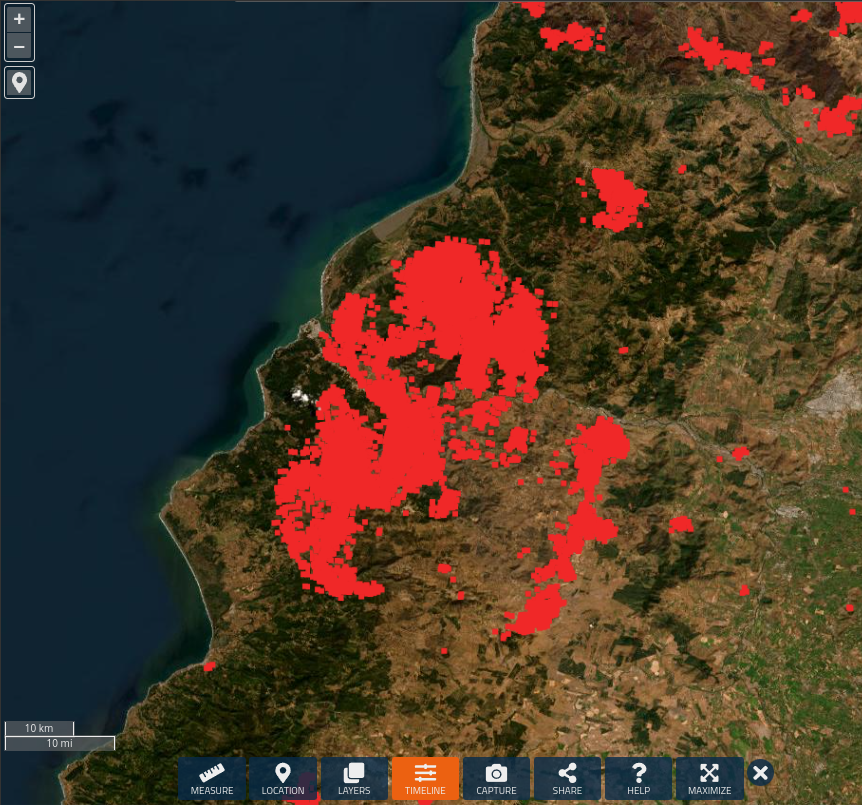
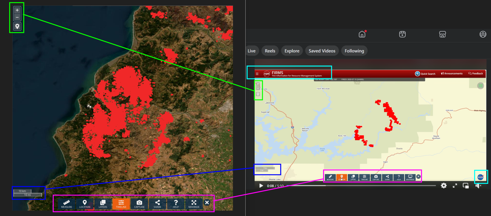
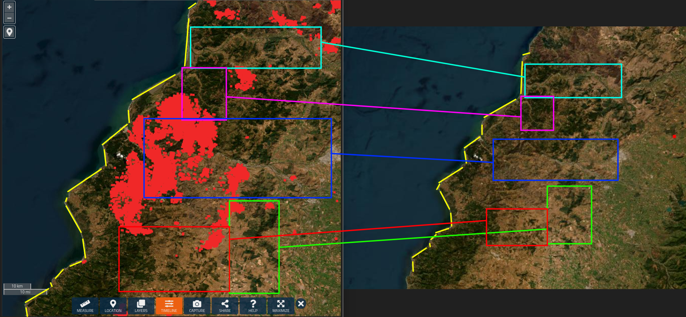
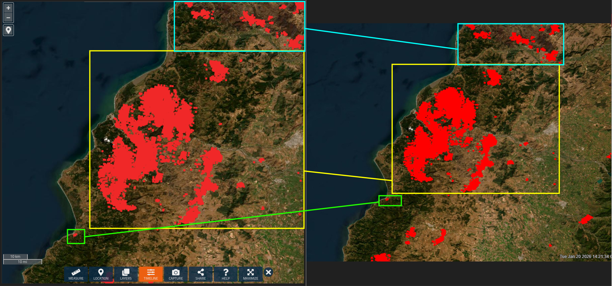

# Welcome to OSINT Exercise #012!

## Task briefing:

The screenshot below shows satellite imagery from a coastal area. Each red pixel represents a 30 metre centre point containing a thermal anomaly. The data is from January.
Please analyse the screenshot and answer the following questions:

    a) Which website was used to produce the image below?

    b) Which is the country seen in the image?

    c) The screenshot shows data from a specific date. Which is the date?

# Seaching process

## Part (a)

I started with looking up this image through Google Lens, Yandex and Bing. As expected, none of the image results exactly matches the shape of the coastline in the satellite image, so I first tried to look for the tool used when this image was taken. One of the search results from Google Lens led me to this Facebook [post](https://www.facebook.com/watch/?v=1773436096909428) containing a 5-minute long video that shows a fire in Shasta National Forest in California on July 18, 2025. This is clearly not the location, but the toolbar buttons (measure, location, timeline etc.) and the map navigation options UI design looks identical to the one in the satellite image. On top of that, the video also captured a red header bar at the top that contains the branding "FIRMS", which stands for Fire Information for Resource Management System, the same tool used to create the satellite image provided in the challenge. When I looked up the keyword, I found their website at https://firms.modaps.eosdis.nasa.gov/, which is the answer to part (a). In the image below, you can see the visual matches between the two pictures. The clues highlighted with neon blue bounding box (specifically the header indicating the name of the tool used and the NASA icon in the bottom-right corner of the page, which reveals that this is a NASA tool) help identify the website where the satellite image was taken.

## Part (b)

This was the section I spent the most time on, as I did made several mistakes while trying to geolocate the country shown in the satellite image. I first tested the mapping tool on the website to see whether it allowed image rotation like Google Maps or Google Earth. Since it did not, this meant that the image was captured in its original orientation, in other words, the coastline shown on the left side of the image is the west coast of the country, which narrowed down to a few regions to look for.

I first looked at Australia, but quickly ruled it out because the western coastline of Australia is mostly dry, flat, and barren, unlike the hilly and forested terrain visible in the image.

Next I checked Africa, because it appeared to have lots of wildfires throughout the year (in different areas depending on the season). If this was the right continent, then the location in the image would be somewhere along the west coast of central to south Africa, as the northern regions are too dry compared to the lush, green landscape in the image. Although, this was soon proved not to be the case because the coastline curves slightly inward in forested areas, which is the opposite of the coast in the image, where most of the visible coast were curves outward.

At this point, I strongly believed the location had to be in either North or South America. The entire west coast of Central America curves inward at a fairly steep angle (relative to the vertical axis), so I completely eliminated it as a potential search region. Given that the inland area (from the satellite image) is fairly hilly and mountainous, I checked whether it could be in western California or Oregon in the United States, which was quickly proven incorrect at a glance. I ruled out Canada as well because of its rugged and highly indented west coast, which also curves inward.

This left only South America, and I began searching along the west coast for areas that were mountainous and covered by forests, which generally points to central to southern Chile. It did not take long to determine that the location in question was on the west coast of the Maule Region in Chile. Therefore, the answer to part (b) is `Chile`.

## Part (c)

Lastly, I needed to determine the date on which the image was taken. I began by using the command-line tool `exiftool` to extract the metadata from the satellite image; however, it did not contain any information that could help approximate when the image was taken or last edited. I then looked for the publication date of the article introducing this exercise by using the Wayback Machine to check when the link was first archived. I found its earliest snapshot on May 10, 2023, which indicates that the image must have been taken before that date.

On FIRMS tool on May 10, 2023, there were no fires in the highlighted region in Chile, so I switched strategies and searched online for any major wildfires in Chile throughout the years, as the dense cluster of red dots indicates a very severe fire event that would have been. During this search, I found a wikipedia page on the [2017 Chile wildfires](https://en.wikipedia.org/wiki/2017_Chile_wildfires). The page describes the wildfire that occurred between January 27-28 as "the worst in Chile's modern history." It reports that the fires killed at least 11 people and displaced thousands in the central Maule Region. This matched the region shown in the satellite image. Upon further investigation, I found that the date containing identical fire data to the satellite image was on January 26, 2017. This confirmes that this satellite image was captured in Maule, Chile during the wildfires in late January, 2017. Therefore, the answer to part (c) is `January 26, 2017.`

