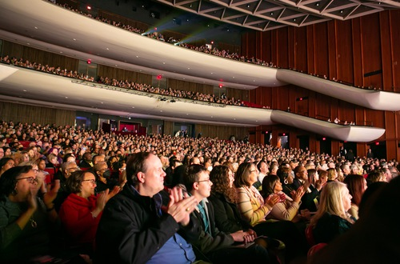
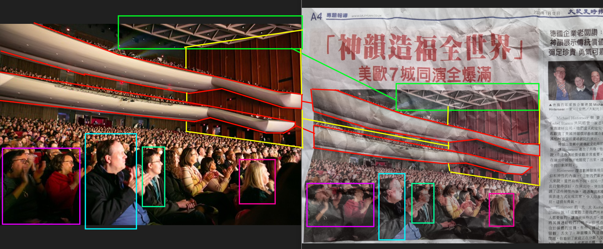

# Exercise 8

## Task briefing

The large photo below was taken from a page of the Epoch Times, a Chinese newspaper.

Please answer the following questions:

    a) What was the audience applauding?

    b) When was the photo taken?

    c) What is the name of the venue?

## Methodology

The first thing I did was run the image through google lens. Initially it showed mixed results until I just highlighted the image only in the photo of the newspaper, then I found this website titled ["Shen Yun Performs in the U.K., Germany, Japan, and the U.S.: “They’re Serving the World” "](https://en.minghui.org/html/articles/2023/1/13/206159.html) published on January 13, 2023, one day after the article published in the epochtimes newspaper on January 12, 2023. The third image in the article was identical to the one in the photo, with its caption revealing all the information we need to answer the three questions:

    a) The audience was applauding the performances by Shen Yun North America Company
    b) The photo was taken on January 7
    c) The name of the venue is Chrysler Hall in Norfolk, Virginia
